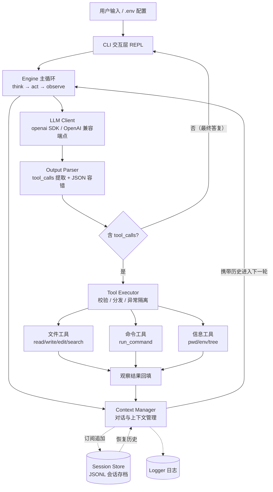
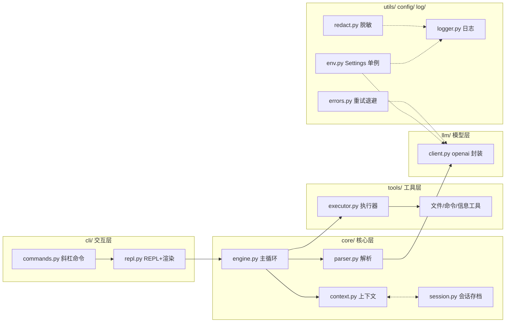

# Cyent — Coding Agent 设计方案

## 一、技术约束与选型

| 维度           | 约定                   | 说明                                                                                                                    |
| -------------- | ---------------------- | ----------------------------------------------------------------------------------------------------------------------- |
| **语言运行时** | **Python 3.14**        | 全程使用 3.14 语法与标准库能力                                                                                          |
| **包管理**     | **uv**                 | `pyproject.toml` + `uv`（`uv add` / `uv run` / `uv lock`）                                                              |
| **模型交互**   | **仅使用 `openai` 库** | 支持任意 OpenAI 兼容端点（自建网关 / DeepSeek / 本地 vLLM 等）                                                          |
| **消息协议**   | **仅处理 OpenAI 格式** | 兼容 `chat.completions` 的 `role` / `content` / `tool_calls` / `tool`                                                  |
| **API 配置**   | **`.env` 文件**        | `OPENAI_BASE_URL` / `OPENAI_API_KEY` / `OPENAI_MODEL`，启动时加载                                                        |
| **可观测性**   | **需要日志**           | 标准 `logging` 分级日志，agent 循环、工具调用、API 请求、错误均落日志                                                    |
| **项目名**     | **Cyent**              | 包名 `cyent`，CLI 入口 `cyent`（argparse）                                                                              |

**依赖范围**：`openai`（唯一模型客户端）、`python-dotenv`（加载 `.env`）、`pytest`（dev 依赖）；其余全部标准库。所有工具在本地 `subprocess` / 文件 API 执行。

---

## 二、分层架构总览（参考现有 agent 项目）

参考 **Claude Code**（分层清晰的 `anthropic` 包裹 + 工具注册 + 主循环）、**OpenCode**（`agents`/`tools`/`provider` 解耦）、**Codex**（流式 + 宽松工具协议）、**DeepSeek Harness**（轻量 agent loop 模板），Cyent 采用以下分层，**每层职责单一、接口明确**：

| 层               | 文件                | 职责                                         | 参考项目对应概念                            |
| ---------------- | ------------------- | -------------------------------------------- | ------------------------------------------- |
| **交互层**       | `cli/`              | REPL、斜杠命令、流式展示、用户中断           | OpenCode `tui` / Claude Code 交互界面       |
| **配置层**       | `config/env.py`     | `.env` 加载、全局配置对象、密钥脱敏读取      | 各项目 `env` / 配置模块                     |
| **日志层**       | `log/logger.py`     | 分级日志、敏感信息过滤、轮转文件          | 各项目 `logger`                             |
| **上下文管理层** | `core/context.py`   | 消息历史、token 估算、裁剪/摘要、system 注入 | OpenCode `context` / Claude Code 上下文裁剪 |
| **主循环层**     | `core/engine.py`    | agent loop 编排、终止判定                    | DeepSeek Harness `agent_loop`               |
| **模型客户端层** | `llm/client.py`     | 封装 `openai` SDK，统一 chat/stream          | OpenCode `provider`                         |
| **输出解析层**   | `core/parser.py`    | 解析 OpenAI 格式 tool_calls + JSON 容错      | 各项目 `parse`                              |
| **工具层**       | `tools/`            | 工具 schema 声明、本地实现                   | OpenCode `tools` 注册表                     |
| **工具执行器**   | `tools/executor.py` | 参数校验、分发、隔离、超时                   | Claude Code `ToolExecutor`                  |
| **错误处理层**   | `utils/errors.py`   | API/工具异常、重试退避                       | 各项目 `retry` / `exceptions`               |
| **会话持久化层** | `core/session.py`   | 会话存档：序列化、原子写、恢复与配对校验     | Claude Code `--resume` / sessions           |

---

## 三、核心数据结构（仅 OpenAI 语义）

全程使用一套对齐 OpenAI `chat.completions` 协议的数据模型，覆盖四种角色 `system / user / assistant / tool`，以及 `tool_calls`（调用请求）与 `tool`（回填结果）。

- `Message`：统一消息载体，按角色区分内容、工具调用列表、工具回填 ID 等。
- `ToolCall`：一次工具调用请求（包含调用 id、工具名、已解析的参数）。
- `ToolSchema`：工具声明，可序列化为 OpenAI 的 function 格式。
- `ChatResult`：模型调用返回（文本内容、解析后的工具调用、结束原因、用量）。

**关键约束（消息配对）**：`assistant.tool_calls` 必须与其后续 `tool` 回填消息**成对出现且顺序一致**，否则 OpenAI API 会返回 400。上下文管理必须保障这一配对完整性——这是整个模块设计的核心难点之一。

---

## 四、各层架构与实现细化

### 4.1 CLI 交互层 `cyent/cli/`
- **REPL 循环**（`repl.py`）：读取输入 → 交给引擎 → 流式渲染；`Session` 在此组装全套组件（client/context/executor/engine/存档）。单任务模式（`-p`）复用同一套组装。
- **斜杠命令**（`commands.py`）：注册表式设计（`SlashCommand` + `CommandRegistry`），内置 `/help` `/model` `/clear` `/tools` `/stats` `/sessions` `/resume` `/new` `/quit`，可注入扩展。
- **用户中断**：`Ctrl+C` 中断当前一轮且不崩溃，回到提示符。
- **交互与引擎解耦**：引擎发布事件流（text/thinking 增量、tool 开始/结果、final、error、interrupted），CLI 只消费渲染，不参与引擎逻辑。

### 4.2 配置层 `cyent/config/env.py`
- `python-dotenv` 从 `./.env` 加载，提供 `.env.example` 模板（不含真实密钥）。
- 全局 `Settings` **单例**：`load()` 仅在入口调用一次，其余全部经 `Settings.get()` 读取。
- **密钥脱敏**：载入时注册密钥，由统一脱敏逻辑在日志/工具输出/存档中替换为掩码；配合 `.gitignore` 确保密钥不进版本库。

### 4.3 日志层 `cyent/log/logger.py`
- 标准 `logging`，**只写轮转文件** `logs/cyent.log`（不写终端——REPL 拥有终端，日志会打断流式渲染）。
- 分级：DEBUG（工具入参出参）/ INFO（循环事件、API 耗时）/ WARNING（重试）/ ERROR（异常）。
- 日志过滤器对密钥脱敏后再落盘。

### 4.4 上下文管理层 `cyent/core/context.py`
- **消息栈维护**：区分用户/助手/工具三类消息的追加，保证 `tool_calls` 与 `tool` 回填配对完整；提供观察者订阅（会话存档挂钩于此）。
- **Token 估算与预算**：近似估算判断是否逼近上限。
- **压缩策略（summarize 优先）**：超限时优先对旧历史做摘要回填（保留信息），仅必要时才丢弃最旧轮次兑底；任何压缩均不破坏配对。

### 4.5 模型客户端层 `cyent/llm/client.py`
- 仅封装 `openai` SDK（端点与密钥来自 `.env`），对外提供**流式**与**非流式**两种对话入口。
- 流式模式同时暴露文本增量（供 CLI 实时渲染）与工具调用增量（合并成完整调用后交解析层）。
- **单一协议直连**：仅处理 OpenAI 格式，直接透传 messages / tools。

### 4.6 输出解析层 `cyent/core/parser.py`
- 从 OpenAI 返回中提取原生 `tool_calls`：调用 id、工具名与参数字符串，并解析为参数对象。
- **JSON 容错**：参数解析失败时做多级修复（去除代码围栏、修正引号/尾逗号、截取合法片段等），仍失败则将原始文本作为观察错误回填给模型并请求修正（限次）。
- **文本与工具混合**：正确分离同一条 assistant 消息中并存的内容文本与工具调用。
- 不处理 Anthropic 的 `tool_use` / `tool_result`。

### 4.7 工具层 `cyent/tools/`
每个工具由**声明**（名称、描述、参数 JSON Schema）与**本地实现**构成，可序列化为 OpenAI function 格式供模型调用，并统一返回给模型一段文本观察结果。工具可分为三类：

**文件工具**：读取文件、写入/覆盖文件、唯一文本匹配替换的编辑、列出目录、在文件/目录内做文本或正则搜索。

**命令工具**：在指定工作目录执行本地命令并捕获标准输出、标准错误与退出码（含超时控制）。

**信息工具**：获取当前工作目录、环境信息、项目结构浏览。

### 4.8 工具执行器 `cyent/tools/executor.py`
- **注册与分发**：维护工具注册表，把全部工具声明一次性传给模型；按调用名分发到对应实现。
- **参数校验**：对参数做必要字段、类型等輕量校验；非法参数返回可读错误给模型重试。
- **异常隔离**：每个工具独立包裹，异常**不中断主循环**，而是转为可见的观察错误文本。
- **超时控制**：命令工具设置超时，超时即强制终止并返回可读错误。
- **安全约束**：命令默认限制在项目工作目录内；危险操作需显式开关；文件类工具遵循路径白名单，防止越权读取工作目录之外路径；输出经脱敏过滤密钥。

### 4.9 主循环层 `cyent/core/engine.py`
ReAct 式 think → act → observe：调用模型 → 有工具调用则本地执行并回填观察 → 下一轮；无工具调用即最终答复。引擎以生成器发布**事件流**（text/thinking 增量、tool 开始/结果、final、error、interrupted），CLI 只消费渲染。

**终止条件（任一满足即退，无迭代上限）：**
1. 本轮无工具调用（模型给出文本答复）；
2. 用户中断（Ctrl+C，由 CLI 注入）；
3. 连续多轮无实质进展（工具结果重复/失败）→ 自动降级并要求模型总结；
4. 不可恢复错误（鉴权失败、摘要后仍超长等）。

### 4.10 错误处理层 `cyent/utils/errors.py`
- **限流 / 网络错误**：指数退避 + 抖动重试（限次）。
- **鉴权 / 配额错误**：不重试，明确报错并提示检查 `.env` 配置。
- **上下文超长**：触发上下文裁剪 / 摘要后再试。
- **工具参数非法 / 执行崩溃 / 超时**：转为可读错误文本回填给模型，不中断循环。
- **解析失败**：附格式修正提示，限次重试。

### 4.11 会话持久化层 `cyent/core/session.py`

**目标**：完整消息历史落盘，下次启动可恢复继续。存档为冷存储（全量），上下文为热窗口（预算内），互不替代。

**设计要点**：
1. **JSONL 追加写**：一条消息一行，崩溃最多丢最后一行；meta 与消息行分离。
2. **配对完整性是恢复红线**：加载时校验配对，损坏部分截断到最近合法边界，绝不带坏历史调 API。
3. **system prompt 不入档**：加载时按当前环境重渲染。
4. **脱敏前置**：写盘前过 `redact()`，存档不落密钥。
5. **观察者挂钩**：存档订阅上下文的追加事件，引擎/客户端零改动。

**CLI 集成**：`cyent -c/--continue`（恢复最近）、`--resume <ID>`、`--list-sessions`；REPL 内 `/sessions` `/resume` `/new`。`/clear` 不删档，仅开新档。

---

## 五、安全与隔离（Cyent 强制）
- `.env` 在 `.gitignore`；代码只读环境变量；`redact()` 全链路脱敏（日志、工具输出、异常信息）。
- 命令工具默认 workdir 边界 + 危险命令开关；文件工具路径白名单。
- 工具输出与日志均经过滤，避免 key / token 泄漏到文件或回显到模型与终端。
- 会话存档写盘前脱敏；`.cyent/` 目录加入 `.gitignore` 与工具层忽略列表。

---

## 六、设计自检

| 要求/红线                     | 本设计如何满足                                               |
| ----------------------------- | ------------------------------------------------------------ |
| 不使用现成 agent 框架/SDK     | 全部自研 `core/` + `tools/`，仅以 `openai` 作为 API 客户端   |
| 不依赖服务端代码执行/文件工具 | 所有工具在本地 `subprocess`/文件 API 执行                    |
| 仅用 `openai` 库与模型        | `llm/client.py` 只封装 `openai` SDK                          |
| 仅处理 OpenAI 格式            | 数据结构与解析完全贴合 `chat.completions`，无 Anthropic 分支 |
| 对话与上下文管理自写          | `context.py`                                                 |
| 工具定义与本地执行自写        | `tools/` + `executor.py`                                     |
| 模型输出解析自写              | `parser.py`                                                  |
| 循环终止条件自写              | `engine.py`                                                  |
| 错误处理自写                  | `utils/errors.py`                                            |
| 用 `uv` 管理                  | `pyproject.toml` + `uv sync/run`                             |
| 用 `.env` 配置 API            | `config/env.py` + `.env.example`                             |
| 需要日志                      | `log/logger.py`（分级 + 轮转 + 脱敏）                        |
| 项目名 `Cyent`                | 包名 `cyent`                                                 |
| Python 3.14                   | `requires-python=">=3.14"`                                   |
| 会话持久化            | `core/session.py` JSONL 存档 + 配对校验 + 脱敏（见 4.11）    |
| API Key 不落仓库/README/视频  | `.gitignore` + `.env` + 全链路 `redact`                      |

---
