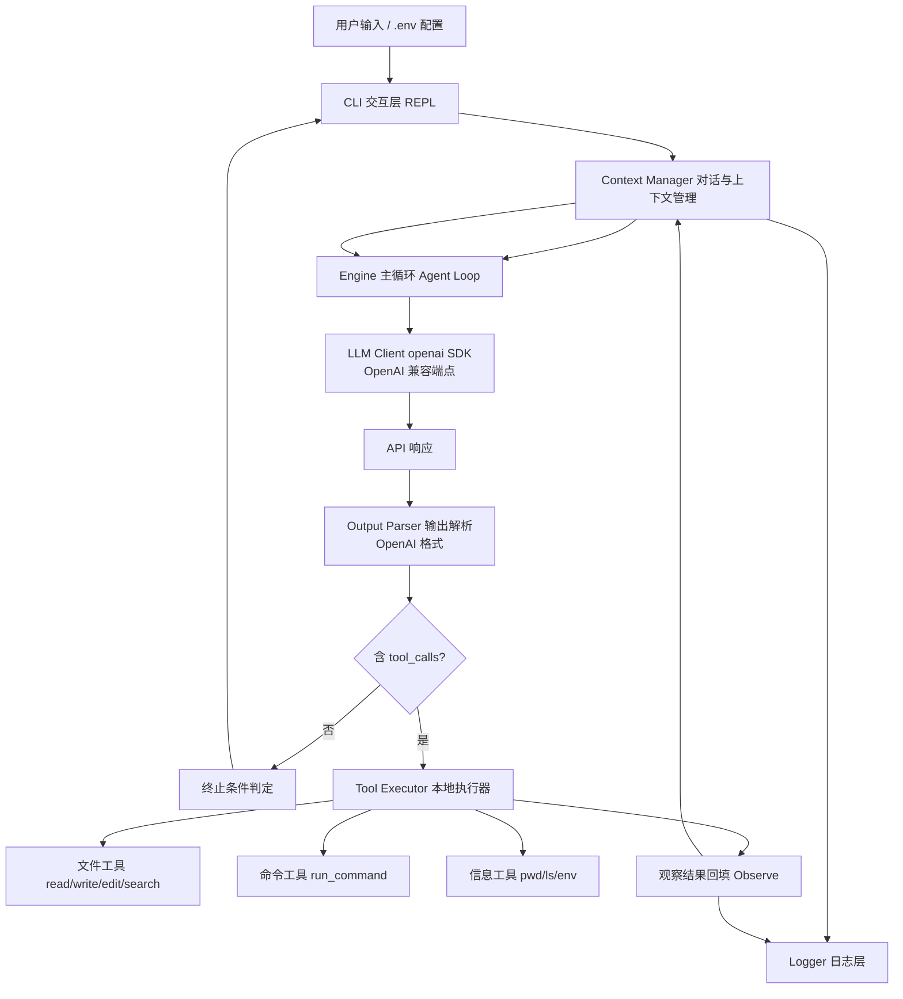
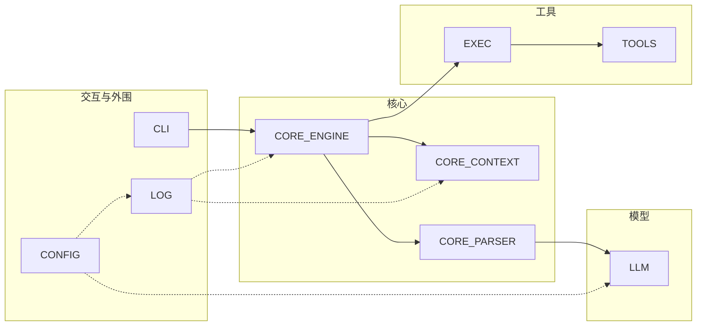

# Cyent — Coding Agent 设计方案

## 一、技术约束与选型

| 维度           | 约定                   | 说明                                                                                                                                                  |
| -------------- | ---------------------- | ----------------------------------------------------------------------------------------------------------------------------------------------------- |
| **语言运行时** | **Python 3.14**        | 全程使用 3.14 语法与标准库能力                                                                                                                        |
| **包管理**     | **uv**                 | 用 `pyproject.toml` + `uv` 管理依赖（`uv add` / `uv run` / `uv lock`），不引入 pip 直装                                                               |
| **模型交互**   | **仅使用 `openai` 库** | 只依赖 `openai` SDK；支持任意 OpenAI 兼容端点（自建网关 / DeepSeek / 本地 vLLM 等）                                                                   |
| **消息协议**   | **仅处理 OpenAI 格式** | 只兼容 `chat.completions` 的 `role` / `content` / `tool_calls` / `tool` 结构，**不考虑 Anthropic**（去掉 `Claude`、`tool_use`、`tool_result` 等分支） |
| **API 配置**   | **`.env` 文件**        | 用 `.env` 存 `OPENAI_BASE_URL` / `OPENAI_API_KEY` / `OPENAI_MODEL`，启动时加载到环境变量                                                              |
| **可观测性**   | **需要日志**           | 内置分级日志（`logging` + 可选的 `loguru`），agent 循环、工具调用、API 请求、错误均落日志                                                             |
| **项目名**     | **Cyent**              | 包名 `cyent`，CLI 入口 `cyent`                                                                                                                        |

**依赖清单（均为非 agent 框架）：**
- `openai`：唯一的模型客户端。
- `python-dotenv`：加载 `.env`。
- 日志库：标准 `logging` 或 `loguru`。
- CLI 库：标准 `argparse` 或 `typer`（二选一即可）。
- `pytest`：测试（dev 依赖）。

**明确不引入**：LangChain / LlamaIndex / OpenAI Agents SDK / AutoGen / CrewAI / Claude Agent SDK 等任何 agent 框架；不调用 API 服务端托管的 code execution / file 工具。



---

## 二、分层架构总览（参考现有 agent 项目）

参考 **Claude Code**（分层清晰的 `anthropic` 包裹 + 工具注册 + 主循环）、**OpenCode**（`agents`/`tools`/`provider` 解耦）、**Codex**（流式 + 宽松工具协议）、**DeepSeek Harness**（轻量 agent loop 模板），Cyent 采用以下分层，**每层职责单一、接口明确**：

| 层               | 文件                | 职责                                         | 参考项目对应概念                            |
| ---------------- | ------------------- | -------------------------------------------- | ------------------------------------------- |
| **交互层**       | `cli/`              | REPL、斜杠命令、流式展示、用户中断           | OpenCode `tui` / Claude Code 交互界面       |
| **配置层**       | `config/env.py`     | `.env` 加载、全局配置对象、密钥脱敏读取      | 各项目 `env` / 配置模块                     |
| **日志层**       | `log/logger.py`     | 分级日志、敏感信息过滤、日志文件+控制台双写  | 各项目 `logger`                             |
| **上下文管理层** | `core/context.py`   | 消息历史、token 估算、裁剪/摘要、system 注入 | OpenCode `context` / Claude Code 上下文裁剪 |
| **主循环层**     | `core/engine.py`    | agent loop 编排、终止判定                    | DeepSeek Harness `agent_loop`               |
| **模型客户端层** | `llm/client.py`     | 封装 `openai` SDK，统一 chat/stream          | OpenCode `provider`                         |
| **输出解析层**   | `core/parser.py`    | 解析 OpenAI 格式 tool_calls + JSON 容错      | 各项目 `parse`                              |
| **工具层**       | `tools/`            | 工具 schema 声明、本地实现                   | OpenCode `tools` 注册表                     |
| **工具执行器**   | `tools/executor.py` | 参数校验、分发、隔离、超时                   | Claude Code `ToolExecutor`                  |
| **错误处理层**   | `utils/errors.py`   | API/工具异常、重试退避                       | 各项目 `retry` / `exceptions`               |



---

## 三、核心数据结构（仅 OpenAI 语义）

全程只使用一套对齐 OpenAI `chat.completions` 协议的数据模型（**无 Anthropic 字段**），覆盖四种角色 `system / user / assistant / tool`，以及 `tool_calls`（调用请求）与 `tool`（回填结果）。

- `Message`：统一消息载体，按角色区分内容、工具调用列表、工具回填 ID 等。
- `ToolCall`：一次工具调用请求（包含调用 id、工具名、已解析的参数）。
- `ToolSchema`：工具声明，可序列化为 OpenAI 的 function 格式。
- `ChatResult`：模型调用返回（文本内容、解析后的工具调用、结束原因、用量）。

**关键约束（消息配对）**：`assistant.tool_calls` 必须与其后续 `tool` 回填消息**成对出现且顺序一致**，否则 OpenAI API 会返回 400。上下文管理必须保障这一配对完整性——这是整个模块设计的核心难点之一。

---

## 四、各层架构与实现细化

### 4.1 CLI 交互层 `cyent/cli/`
- **REPL 循环**：读取用户输入 → 交给引擎 → 流式打印 assistant 正文；提示符显示当前模型名。
- **斜杠命令**：提供若干控制命令（如帮助、退出、切换模型、清空上下文、查看日志）。
- **用户中断**：支持 `Ctrl+C` 中断**当前一轮** agent loop 且不崩溃，便于回到提示符继续交互。
- 参考 OpenCode 的 tui 设计：**交互与引擎解耦**——引擎对外发布一组**事件流**（如文本增量、工具开始、工具结果、完成、错误），CLI 仅负责消费并渲染这些事件，不直接参与引擎逻辑。

### 4.2 配置层 `cyent/config/env.py`
- 用 `python-dotenv` 从 `.env` 加载配置，并提供 `.env.example` 模板（不含真实密钥）。
- 定义全局 `Settings`，集中管理端点、密钥、模型名、最大迭代次数、日志目录等运行参数。
- **密钥脱敏**：配置载入时记录密钥，由统一的脱敏逻辑在日志与工具输出中替换为掩码。
- 与 `.gitignore` 配合，确保密钥不进入版本库。

### 4.3 日志层 `cyent/log/logger.py`
- 选择标准 `logging` 或 `loguru`，输出到**控制台 + 轮转文件**。
- 采用**分级日志**：调试（完整消息/工具入参出参）、信息（agent 循环事件、API 耗时）、警告（重试）、错误（异常）。
- **敏感过滤**：注册日志过滤器，对密钥、鉴权 token 等进行脱敏后再输出，避免泄密。

### 4.4 上下文管理层 `cyent/core/context.py`
- **消息栈维护**：区分用户、助手、工具三类消息的追加，并保证 `assistant.tool_calls` 与其后续 `tool` 回填消息配对完整。
- **System prompt 注入**：动态拼装角色定义、工具说明、工作目录与输出约定，可随轮次更新。
- **Token 估算**：通过近似估算或模型返回的用量累计判断是否逼近上限。
- **裁剪 / 压缩**：超限时优先丢弃最旧的成对对话（保持 tool 配对），保留最近轮次与系统提示；仍超限则对最旧段落做一次摘要并回填。
- 参考 Claude Code 的上下文预算管理与 DeepSeek Harness 的"固定窗口 + 摘要"策略。

### 4.5 模型客户端层 `cyent/llm/client.py`
- 仅封装 `openai` SDK（端点与密钥来自 `.env`），对外提供**流式**与**非流式**两种对话入口。
- 流式模式既要把文本增量逐段暴露给 CLI 展示，也要把被切分的 `tool_calls` 增量**按下标合并**成完整的调用，再交给解析层处理。
- **不做多厂商中枢**：因仅处理 OpenAI 格式，直接透传 messages / tools，无需构建多厂商适配转换层，降低复杂度与出错面。

### 4.6 输出解析层 `cyent/core/parser.py`
- 从 OpenAI 返回中提取原生 `tool_calls`：调用 id、工具名与参数字符串，并解析为参数对象。
- **JSON 容错**：参数解析失败时做多级修复（去除代码围栏、修正引号/尾逗号、截取合法片段等），仍失败则将原始文本作为观察错误回填给模型并请求修正（限次）。
- **文本与工具混合**：正确分离同一条 assistant 消息中并存的内容文本与工具调用。
- 不处理 Anthropic 的 `tool_use` / `tool_result`。

### 4.7 工具层 `cyent/tools/`
每个工具由**声明**（名称、描述、参数 JSON Schema）与**本地实现**构成，可序列化为 OpenAI function 格式供模型调用，并统一返回给模型一段文本观察结果。工具可分为三类：

**文件工具**：读取文件、写入/覆盖文件、唯一文本匹配替换的编辑、列出目录、在文件/目录内做文本或正则搜索。

**命令工具**：在指定工作目录执行本地命令并捕获标准输出、标准错误与退出码（含超时控制）。

**信息工具**：获取当前工作目录、环境信息、项目结构浏览。

### 4.8 工具执行器 `cyent/tools/executor.py`
- **注册与分发**：维护工具注册表，把全部工具声明一次性传给模型；按调用名分发到对应实现。
- **参数校验**：对参数做必要字段、类型等輕量校验；非法参数返回可读错误给模型重试。
- **异常隔离**：每个工具独立包裹，异常**不中断主循环**，而是转为可见的观察错误文本。
- **超时控制**：命令工具设置超时，超时即强制终止并返回可读错误。
- **安全约束**：命令默认限制在项目工作目录内；危险操作需显式开关；文件类工具遵循路径白名单，防止越权读取工作目录之外路径；输出经脱敏过滤密钥。

### 4.9 主循环层 `cyent/core/engine.py`
**核心逻辑之一**，采用 ReAct 式的 think → act → observe 循环：调用模型 → 若模型返回工具调用则在本地执行并把结果作为观察回填后再进入下一轮；若无工具调用则视为完成，输出最终答复并退出。

**终止条件（任一满足即退）：**
1. 达到最大迭代次数（防死循环）；
2. 本轮无工具调用（模型直接给出文本答复）；
3. 用户中断（由 CLI 层注入）；
4. 连续多轮无实质进展（工具结果重复／失败）→ 自动降级并汇总；
5. 显式退出／结束标记。

### 4.10 错误处理层 `cyent/utils/errors.py`
- **限流 / 网络错误**：指数退避 + 抖动重试（限次）。
- **鉴权 / 配额错误**：不重试，明确报错并提示检查 `.env` 配置。
- **上下文超长**：触发上下文裁剪 / 摘要后再试。
- **工具参数非法 / 执行崩溃 / 超时**：转为可读错误文本回填给模型，不中断循环。
- **解析失败**：附格式修正提示，限次重试。

---

## 五、安全与隔离（Cyent 强制）
- `.env` 在 `.gitignore`；代码只读环境变量；`redact()` 全链路脱敏（日志、工具输出、异常信息）。
- 命令工具默认 workdir 边界 + 危险命令开关；文件工具路径白名单。
- 工具输出与日志均经过滤，避免 key / token 泄漏到文件或回显到模型与终端。

---

## 六、目录结构

```
Cyent/                         # 项目根
├── README.txt                 # 提交物：≤1000 汉字说明
├── Design.md                  # 本设计文档
├── pyproject.toml             # uv 管理；name = "cyent"
├── uv.lock                    # uv 锁定文件
├── .env.example               # 配置模板（不含真实 key）
├── .gitignore                 # 忽略 .env / logs / __pycache__
├── src/cyent/
│   ├── __init__.py
│   ├── main.py                # CLI 入口（`cyent` 命令）
│   ├── cli/
│   │   └── repl.py            # REPL + 斜杠命令 + 事件渲染
│   ├── config/
│   │   └── env.py             # .env 加载 + Settings + 脱敏
│   ├── log/
│   │   └── logger.py          # 日志初始化 + redact filter
│   ├── core/
│   │   ├── types.py           # Message/ToolCall/ToolSchema/ChatResult
│   │   ├── context.py         # 对话与上下文管理
│   │   ├── parser.py          # OpenAI 输出解析
│   │   └── engine.py          # 主循环与终止条件
│   ├── llm/
│   │   └── client.py          # openai SDK 封装
│   ├── tools/
│   │   ├── base.py            # BaseTool
│   │   ├── file_tools.py      # 文件读写搜索
│   │   ├── command_tools.py   # 本地命令执行
│   │   ├── info_tools.py      # 环境/目录信息
│   │   └── executor.py        # 注册 + 校验 + 分发 + 隔离
│   └── utils/
│       ├── errors.py          # 异常类型与重试退避
│       └── redact.py          # 敏感信息过滤
├── tests/                     # 单元测试
└── logs/                      # 运行时日志（gitignore）
```

---

## 八、实现路线图（Milestone）

| 阶段 | 内容                                           | 验收                              |
| ---- | ---------------------------------------------- | --------------------------------- |
| M1   | `uv init` + 类型 + `client.py` + `.env`/日志   | 能发起一次对话拿到回复            |
| M2   | `parser.py` 解析 OpenAI tool_calls + JSON 容错 | 能解析模型工具调用                |
| M3   | `tools/`（文件+命令+信息）+ `executor.py`      | 能本地读写文件、执行命令          |
| M4   | `engine.py` 主循环 + 终止条件                  | 能"看问题→改文件→跑命令→结论"闭环 |
| M5   | `context.py` token/裁剪/摘要                   | 长任务不爆上下文                  |
| M6   | `errors.py` 重试 + `redact` 脱敏               | 网络抖动恢复，key 不泄漏          |
| M7   | CLI 打磨 + 演示脚本 + README/视频              | 跑通真实任务，录制视频            |

---

## 九、设计自检

| 要求/红线                     | 本设计如何满足                                               |
| ----------------------------- | ------------------------------------------------------------ |
| 不使用现成 agent 框架/SDK     | 全部自研 `core/` + `tools/`，仅以 `openai` 作为 API 客户端   |
| 不依赖服务端代码执行/文件工具 | 所有工具在本地 `subprocess`/文件 API 执行                    |
| 仅用 `openai` 库与模型        | `llm/client.py` 只封装 `openai` SDK                          |
| 仅处理 OpenAI 格式            | 数据结构与解析完全贴合 `chat.completions`，无 Anthropic 分支 |
| 对话与上下文管理自写          | `context.py`                                                 |
| 工具定义与本地执行自写        | `tools/` + `executor.py`                                     |
| 模型输出解析自写              | `parser.py`                                                  |
| 循环终止条件自写              | `engine.py`                                                  |
| 错误处理自写                  | `utils/errors.py`                                            |
| 用 `uv` 管理                  | `pyproject.toml` + `uv sync/run`                             |
| 用 `.env` 配置 API            | `config/env.py` + `.env.example`                             |
| 需要日志                      | `log/logger.py`（分级 + 轮转 + 脱敏）                        |
| 项目名 `Cyent`                | 包名 `cyent`                                                 |
| Python 3.14                   | `requires-python=">=3.14"`                                   |
| API Key 不落仓库/README/视频  | `.gitignore` + `.env` + 全链路 `redact`                      |

---
